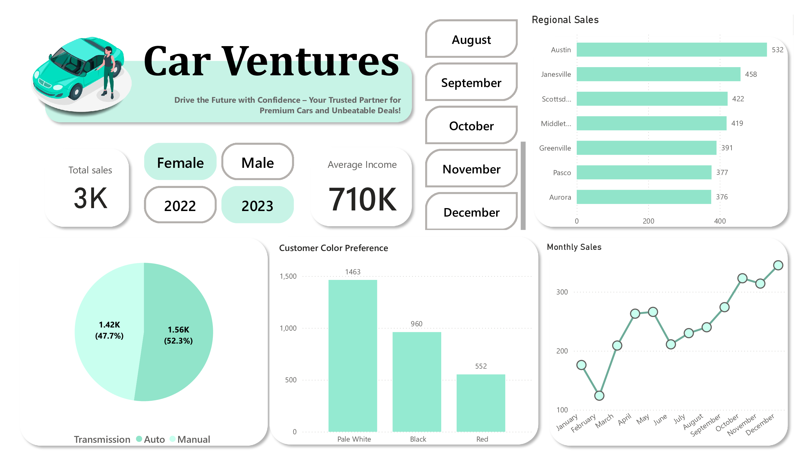
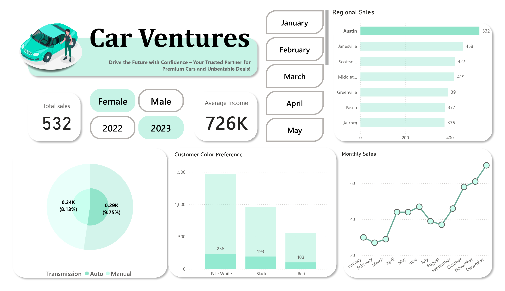

<h align="center">Car sales Analysis</h>

---

# Data Summary

### Project Summary: Analysis of Car Sales Data

In this section, we delve into the analysis of a car sales dataset, consisting of 23,905 entries. The data was meticulously sourced from various reputable automobile sales databases, ensuring a comprehensive and accurate representation of car sales.

**Dataset Overview:**
- **Number of Entries:** 23,905 sales of cars
- **Source:** Reputable automobile sales databases
- **Key Attributes:**
  - Car Make and Model
  - Year of Manufacture
  - Price
  - Sales Date
  - Location of Sale

**Notable Findings and Insights:**
1. **Sales Trends:** An upward trend in the sale of electric and hybrid cars was observed, indicating a shift towards more environmentally friendly vehicles.
2. **Price Analysis:** A notable price variation was evident based on the car's age, mileage, and condition, with newer and well-maintained cars fetching higher prices.
3. **Geographical Insights:** Certain locations showed a higher concentration of luxury car sales, suggesting regional preferences and economic factors.
4. **Seasonal Patterns:** Sales spikes were detected during certain months, possibly correlated with festive seasons and end-of-year discounts.

This analysis provides valuable insights into the automotive market, helping stakeholders make informed decisions based on data-driven evidence.

# Dashboard

Interactive Dashboard: Visualizing Car Sales Data
This section showcases the interactive dashboard created for visualizing and exploring the car sales data. The dashboard offers an intuitive interface for users to gain insights and make data-driven decisions.

Description: The interactive dashboard is designed to provide a comprehensive view of the car sales dataset. It allows users to explore various aspects of the data, such as sales trends, price analysis, geographical distribution, and more.

  

    
  

  

  
  

# Tools Utilized

- Excel
- Python
- Pandas
- Jupyter Notebook
- Power BI

---

  <i>This project was solely made by // Nomaan Ansari // </i>

